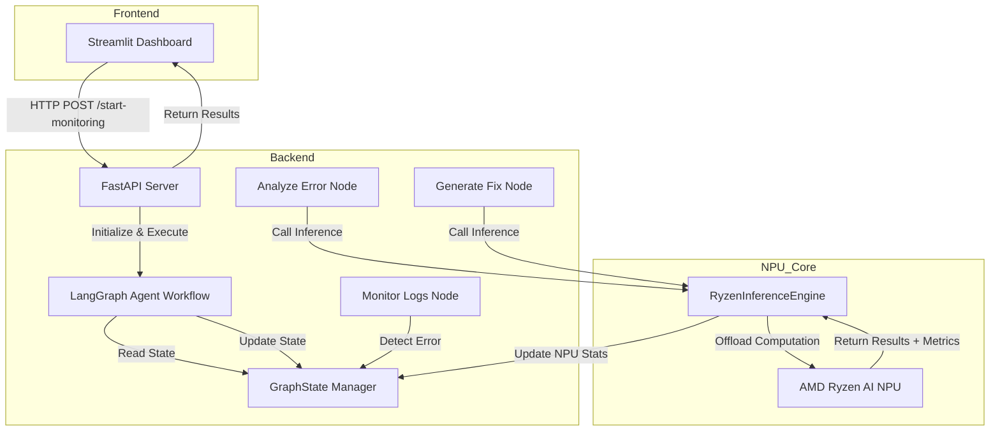

# Design Document: Aegis-8645 DevOps Agent

## Overview

Aegis-8645 is a self-healing DevOps agent that leverages AMD Ryzen AI NPU hardware for local LLM inference. The system monitors application logs, detects errors, performs root cause analysis, and generates fix suggestions through a stateful multi-agent workflow orchestrated by LangGraph.

The architecture follows a modular design with three primary components:
- **Backend**: FastAPI server with LangGraph agent workflow and NPU integration
- **Frontend**: Streamlit dashboard for real-time telemetry visualization
- **NPU Core**: Inference engine interfacing with AMD Ryzen AI hardware

The system operates entirely locally, eliminating cloud dependencies and ensuring data privacy while leveraging hardware acceleration for LLM inference.

## Architecture

### High-Level Architecture



### Component Interaction Flow

1. **Monitoring Trigger**: User initiates monitoring via Streamlit dashboard or direct API call
2. **Workflow Initialization**: FastAPI endpoint creates LangGraph workflow with initial state
3. **Log Monitoring**: Monitor node reads log files and detects errors
4. **Error Analysis**: Analyzer node sends error to NPU for root cause determination
5. **Fix Generation**: Generator node sends analysis to NPU for fix creation
6. **State Updates**: Each node updates GraphState with results and NPU metrics
7. **Response Delivery**: API returns complete workflow results to dashboard
8. **Telemetry Display**: Dashboard visualizes NPU metrics and workflow outputs

### Technology Stack

- **Backend Framework**: FastAPI (async REST API)
- **Agent Orchestration**: LangGraph (stateful workflow management)
- **LLM Inference**: ONNX Runtime with AMD Ryzen AI NPU
- **Model**: Llama-3-8B (quantized for NPU)
- **Frontend**: Streamlit (real-time dashboard)
- **Language**: Python 3.10+

## Components and Interfaces

### 1. GraphState (State Management)

**Purpose**: Centralized state object for LangGraph workflow

**Interface**:
```python
class GraphState(TypedDict):
    logs: List[str]
    detected_error: str
    root_cause: str
    suggested_fix: str
    npu_stats: dict
```

**Fields**:
- `logs`: List of log entries read from log files
- `detected_error`: The identified error message (e.g., HTTP 500 error)
- `root_cause`: LLM-generated analysis of why the error occurred
- `suggested_fix`: LLM-generated code diff or configuration change
- `npu_stats`: Dictionary containing `latency_ms` and `utilization_percent`

**Responsibilities**:
- Maintain workflow state across node transitions
- Provide type-safe access to workflow data
- Enable state persistence for debugging and auditing

### 2. RyzenInferenceEngine (NPU Integration)

**Purpose**: Interface with AMD Ryzen AI NPU for LLM inference

**Location**: `backend/npu/engine.py`

**Interface**:
```python
class RyzenInferenceEngine:
    def __init__(self, model_path: str, use_mock: bool = False):
        """Initialize engine with model path and mode selection"""
        pass
    
    def run_inference(self, prompt: str) -> Tuple[str, dict]:
        """
        Execute LLM inference on NPU
        
        Args:
            prompt: Input text for the LLM
            
        Returns:
            Tuple of (response_text, npu_stats)
            where npu_stats = {"latency_ms": float, "utilization_percent": float}
        """
        pass
    
    def load_model(self) -> None:
        """Load quantized Llama-3-8B model into NPU memory"""
        pass
    
    def is_npu_available(self) -> bool:
        """Check if AMD Ryzen AI NPU hardware is available"""
        pass
```

**Responsibilities**:
- Load and manage quantized Llama-3-8B model
- Execute inference on AMD Ryzen AI NPU via ONNX Runtime
- Track and return NPU performance metrics (latency, utilization)
- Provide mock implementation when NPU hardware is unavailable
- Handle NPU errors and fallback scenarios

**Mock Mode Behavior**:
- Simulate inference latency: random delay between 100-500ms
- Simulate NPU utilization: random value between 40-80%
- Return plausible mock responses based on prompt patterns
- Log mock mode operation for transparency

### 3. Agent Workflow Nodes

#### 3.1 Monitor Logs Node

**Purpose**: Read log files and detect errors

**Interface**:
```python
def monitor_logs(state: GraphState) -> GraphState:
    """
    Read log files and detect errors
    
    Args:
        state: Current GraphState with log_path in metadata
        
    Returns:
        Updated GraphState with logs and detected_error populated
    """
    pass
```

**Responsibilities**:
- Read log files from specified path
- Parse log entries (support JSON and plain text formats)
- Detect error patterns (HTTP 500, exceptions, ERROR level logs)
- Extract error messages with surrounding context
- Update GraphState.logs and GraphState.detected_error
- Determine next node transition (analyze_error if error found, end if not)

**Error Detection Patterns**:
- HTTP status codes: 500, 502, 503, 504
- Exception keywords: "Exception", "Error", "Traceback"
- Log levels: "ERROR", "CRITICAL", "FATAL"
- Stack trace patterns

#### 3.2 Analyze Error Node

**Purpose**: Determine root cause of detected errors using NPU inference

**Interface**:
```python
def analyze_error(state: GraphState) -> GraphState:
    """
    Analyze detected error to determine root cause
    
    Args:
        state: GraphState with detected_error populated
        
    Returns:
        Updated GraphState with root_cause and npu_stats populated
    """
    pass
```

**Responsibilities**:
- Construct analysis prompt from detected error and log context
- Call RyzenInferenceEngine.run_inference() with prompt
- Parse LLM response to extract root cause explanation
- Update GraphState.root_cause with analysis
- Update GraphState.npu_stats with inference metrics
- Transition to generate_fix node

**Prompt Template**:
```
You are a DevOps expert analyzing application errors.

Error detected:
{detected_error}

Log context:
{surrounding_logs}

Analyze the root cause of this error. Consider:
- Code logic issues
- Configuration problems
- Resource constraints
- Dependency failures

Provide a concise root cause analysis.
```

#### 3.3 Generate Fix Node

**Purpose**: Generate code fixes or configuration changes using NPU inference

**Interface**:
```python
def generate_fix(state: GraphState) -> GraphState:
    """
    Generate fix suggestion based on root cause analysis
    
    Args:
        state: GraphState with root_cause populated
        
    Returns:
        Updated GraphState with suggested_fix and npu_stats populated
    """
    pass
```

**Responsibilities**:
- Construct fix generation prompt from root cause and error
- Call RyzenInferenceEngine.run_inference() with prompt
- Parse LLM response to extract code diff or configuration change
- Format fix as unified diff with file paths and line numbers
- Update GraphState.suggested_fix with formatted diff
- Update GraphState.npu_stats with inference metrics
- Mark workflow as complete

**Prompt Template**:
```
You are a DevOps expert generating fixes for application errors.

Error: {detected_error}
Root Cause: {root_cause}

Generate a fix for this issue. Provide:
- File path to modify
- Unified diff format showing changes
- Explanatory comments

Format as a code diff that can be applied directly.
```

### 4. LangGraph Workflow

**Purpose**: Orchestrate agent nodes with state management

**Interface**:
```python
def create_workflow() -> StateGraph:
    """
    Create LangGraph workflow with nodes and edges
    
    Returns:
        Compiled StateGraph ready for execution
    """
    pass

def execute_workflow(log_path: str) -> GraphState:
    """
    Execute complete workflow for given log file
    
    Args:
        log_path: Path to log file to monitor
        
    Returns:
        Final GraphState with all results
    """
    pass
```

**Workflow Definition**:
```python
workflow = StateGraph(GraphState)

# Add nodes
workflow.add_node("monitor_logs", monitor_logs)
workflow.add_node("analyze_error", analyze_error)
workflow.add_node("generate_fix", generate_fix)

# Define edges
workflow.set_entry_point("monitor_logs")
workflow.add_conditional_edges(
    "monitor_logs",
    lambda state: "analyze_error" if state["detected_error"] else END
)
workflow.add_edge("analyze_error", "generate_fix")
workflow.add_edge("generate_fix", END)

# Compile
app = workflow.compile()
```

**State Transitions**:
1. START → monitor_logs
2. monitor_logs → analyze_error (if error detected) OR END (if no error)
3. analyze_error → generate_fix
4. generate_fix → END

### 5. FastAPI Backend

**Purpose**: REST API for triggering monitoring and retrieving results

**Location**: `backend/api/main.py`

**Endpoints**:

#### POST /start-monitoring

**Request**:
```json
{
  "log_path": "/path/to/application.log"
}
```

**Response** (Success - 200):
```json
{
  "status": "completed",
  "detected_error": "HTTP 500 Internal Server Error at /api/users",
  "root_cause": "NullPointerException due to missing user validation",
  "suggested_fix": "--- a/api/users.py\n+++ b/api/users.py\n@@ -10,6 +10,8 @@\n def get_user(user_id):\n+    if user_id is None:\n+        raise ValueError('user_id required')\n     return db.query(user_id)",
  "npu_stats": {
    "latency_ms": 245.3,
    "utilization_percent": 67.5
  }
}
```

**Response** (Error - 500):
```json
{
  "status": "error",
  "message": "Failed to read log file: /path/to/application.log"
}
```

**Implementation**:
```python
@app.post("/start-monitoring")
async def start_monitoring(request: MonitoringRequest):
    """
    Trigger agent workflow for log monitoring
    
    Args:
        request: Contains log_path
        
    Returns:
        Workflow results with error analysis and fix
    """
    pass
```

### 6. Streamlit Dashboard

**Purpose**: Real-time visualization of NPU metrics and workflow results

**Location**: `frontend/dashboard.py`

**Components**:

1. **Header Section**:
   - Application title and description
   - NPU status indicator (available/mock mode)

2. **Control Panel**:
   - Log path input field
   - "Start Monitoring" button
   - Workflow status indicator

3. **Metrics Display**:
   - NPU Latency gauge (milliseconds)
   - NPU Utilization gauge (percentage)
   - Historical metrics chart (line graph over time)

4. **Results Panel**:
   - Detected Error (expandable text area)
   - Root Cause Analysis (expandable text area)
   - Suggested Fix (code diff with syntax highlighting)

5. **Real-time Updates**:
   - Auto-refresh every 2 seconds when workflow is running
   - WebSocket connection for live metric streaming (optional enhancement)

**Interface**:
```python
def render_dashboard():
    """Render main Streamlit dashboard"""
    pass

def call_monitoring_api(log_path: str) -> dict:
    """Call FastAPI /start-monitoring endpoint"""
    pass

def display_metrics(npu_stats: dict):
    """Display NPU metrics with gauges and charts"""
    pass

def display_results(detected_error: str, root_cause: str, suggested_fix: str):
    """Display workflow results in formatted panels"""
    pass
```

## Data Models

### GraphState Schema

```python
from typing import TypedDict, List

class GraphState(TypedDict):
    """State object for LangGraph workflow"""
    logs: List[str]              # Raw log entries
    detected_error: str          # Identified error message
    root_cause: str              # LLM analysis of error cause
    suggested_fix: str           # Generated code diff
    npu_stats: dict              # {"latency_ms": float, "utilization_percent": float}
```

### MonitoringRequest Schema

```python
from pydantic import BaseModel

class MonitoringRequest(BaseModel):
    """Request model for /start-monitoring endpoint"""
    log_path: str                # Path to log file
```

### MonitoringResponse Schema

```python
from pydantic import BaseModel
from typing import Optional

class NPUStats(BaseModel):
    """NPU performance metrics"""
    latency_ms: float
    utilization_percent: float

class MonitoringResponse(BaseModel):
    """Response model for /start-monitoring endpoint"""
    status: str                  # "completed" or "error"
    detected_error: Optional[str] = None
    root_cause: Optional[str] = None
    suggested_fix: Optional[str] = None
    npu_stats: Optional[NPUStats] = None
    message: Optional[str] = None  # Error message if status is "error"
```

### NPU Inference Result

```python
from typing import Tuple

# Return type for RyzenInferenceEngine.run_inference()
InferenceResult = Tuple[str, dict]
# (response_text, {"latency_ms": float, "utilization_percent": float})
```

## Correctness Properties


*A property is a characteristic or behavior that should hold true across all valid executions of a system—essentially, a formal statement about what the system should do. Properties serve as the bridge between human-readable specifications and machine-verifiable correctness guarantees.*

### Property 1: Agent Node State Passing

*For any* agent node in the workflow and any GraphState, when the node is executed, it should receive the current GraphState as its input parameter.

**Validates: Requirements 2.2**

### Property 2: Agent Node State Modification

*For any* agent node that performs work (monitor_logs, analyze_error, generate_fix), executing the node should produce an output GraphState that differs from the input GraphState in at least one field.

**Validates: Requirements 2.3**

### Property 3: GraphState Field Type Consistency

*For any* GraphState instance, the logs field should be a list of strings, detected_error should be a string, root_cause should be a string, suggested_fix should be a string, and npu_stats should be a dictionary containing "latency_ms" and "utilization_percent" keys.

**Validates: Requirements 2.4, 2.5, 2.6, 2.7, 2.8**

### Property 4: NPU Inference Returns Valid Metrics

*For any* call to RyzenInferenceEngine.run_inference(), the returned npu_stats dictionary should contain a "latency_ms" key with a positive float value and a "utilization_percent" key with a value between 0 and 100.

**Validates: Requirements 3.4, 3.5**

### Property 5: Log Parsing Completeness

*For any* log file, when Log_Monitor parses it, the number of entries in GraphState.logs should equal the number of non-empty lines in the file.

**Validates: Requirements 7.1, 7.2**

### Property 6: Error Pattern Detection

*For any* log file containing HTTP 500 errors, exception stack traces, or ERROR-level messages, when Log_Monitor processes it, GraphState.detected_error should be populated with a non-empty string.

**Validates: Requirements 7.3, 7.4, 7.5, 7.6**

### Property 7: Error Detection Format Support

*For any* log file in JSON or plain text format, Log_Monitor should successfully parse it without raising exceptions.

**Validates: Requirements 7.7**

### Property 8: Workflow Routing on Error Detection

*For any* log file with detected errors, after monitor_logs executes, the workflow should transition to the analyze_error node; for any log file without errors, the workflow should end.

**Validates: Requirements 4.5, 7.8**

### Property 9: Analysis Node Populates Root Cause

*For any* GraphState with a non-empty detected_error field, after analyze_error executes, GraphState.root_cause should be populated with a non-empty string.

**Validates: Requirements 4.6, 8.4, 8.5**

### Property 10: Fix Generation Node Populates Suggested Fix

*For any* GraphState with a non-empty root_cause field, after generate_fix executes, GraphState.suggested_fix should be populated with a non-empty string.

**Validates: Requirements 4.8**

### Property 11: Workflow Sequential Execution

*For any* workflow execution that detects an error, the nodes should execute in order: monitor_logs → analyze_error → generate_fix, with each node completing before the next begins.

**Validates: Requirements 4.7**

### Property 12: NPU Stats Updated After Inference

*For any* node (analyze_error or generate_fix) that calls RyzenInferenceEngine, after the node executes, GraphState.npu_stats should contain updated metrics with valid latency and utilization values.

**Validates: Requirements 4.9**

### Property 13: Analyzer Prompt Contains Error Context

*For any* detected error, when Error_Analyzer constructs a prompt, the prompt string should contain both the error message text and surrounding log context.

**Validates: Requirements 8.1, 8.2, 8.3**

### Property 14: Fix Generator Prompt Contains Root Cause

*For any* root cause analysis, when Fix_Generator constructs a prompt, the prompt string should contain both the root cause text and the original error message.

**Validates: Requirements 9.1, 9.2, 9.3**

### Property 15: Generated Fix Follows Unified Diff Format

*For any* suggested fix generated by Fix_Generator, the fix string should contain unified diff markers ("---", "+++", "@@") and file path indicators.

**Validates: Requirements 9.4, 9.5**

### Property 16: API Response Contains All Required Fields

*For any* successful workflow completion, the /start-monitoring endpoint response should contain all required fields: detected_error, root_cause, suggested_fix, and npu_stats.

**Validates: Requirements 5.6**

### Property 17: API Returns Success Status on Completion

*For any* workflow that completes without exceptions, the /start-monitoring endpoint should return HTTP 200 status code.

**Validates: Requirements 5.7**

### Property 18: Dashboard Renders Complete Workflow Data

*For any* workflow result containing detected_error, root_cause, suggested_fix, and npu_stats, the Telemetry_Dashboard rendering should include all four data elements in the output.

**Validates: Requirements 6.2, 6.3, 6.4, 6.5, 6.6**

### Property 19: Mock Mode Latency Within Bounds

*For any* inference call in mock mode, the returned latency_ms value should be between 100 and 500 milliseconds.

**Validates: Requirements 10.2**

### Property 20: Mock Mode Utilization Within Bounds

*For any* inference call in mock mode, the returned utilization_percent value should be between 40 and 80 percent.

**Validates: Requirements 10.3**

### Property 21: Mock Mode Returns Non-Empty Responses

*For any* inference call in mock mode (whether for error analysis or fix generation), the returned response string should be non-empty and contain plausible content.

**Validates: Requirements 10.4, 10.5**

### Property 22: Workflow Execution Completes

*For any* valid log file path provided to /start-monitoring, the Agent_Workflow should execute to completion without hanging or raising unhandled exceptions.

**Validates: Requirements 5.5**

## Error Handling

### NPU Inference Errors

**Scenario**: NPU hardware failure or ONNX Runtime error during inference

**Handling**:
- Catch exceptions from ONNX Runtime
- Log error details with timestamp and stack trace
- Automatically fall back to mock mode
- Update npu_stats with error indicator: `{"error": true, "message": "NPU unavailable"}`
- Continue workflow execution using mock inference
- Return workflow results with fallback indicator in response

### Log File Access Errors

**Scenario**: Log file does not exist, insufficient permissions, or file is locked

**Handling**:
- Catch file I/O exceptions in monitor_logs node
- Return HTTP 500 from /start-monitoring endpoint
- Include descriptive error message: "Failed to read log file: {path}"
- Log error details for debugging
- Do not proceed with workflow execution

### Invalid Log Format

**Scenario**: Log file contains unparseable content or unexpected format

**Handling**:
- Attempt to parse as plain text if JSON parsing fails
- Skip malformed lines and continue processing valid lines
- Log warning for each skipped line
- If no valid lines can be parsed, treat as empty log (no errors detected)
- Complete workflow normally with available data

### LLM Response Parsing Errors

**Scenario**: NPU returns malformed or unexpected response format

**Handling**:
- Catch parsing exceptions in analyze_error and generate_fix nodes
- Use fallback response: "Unable to analyze error" or "Unable to generate fix"
- Log the raw LLM response for debugging
- Continue workflow to completion with fallback values
- Include warning in API response

### Workflow State Corruption

**Scenario**: GraphState contains invalid or inconsistent data

**Handling**:
- Validate GraphState schema before each node execution
- Raise ValidationError if required fields are missing or wrong type
- Catch ValidationError at workflow level
- Return HTTP 500 with error details
- Log complete state for debugging

### API Request Validation Errors

**Scenario**: /start-monitoring receives invalid request (missing log_path, wrong type)

**Handling**:
- Use Pydantic validation on MonitoringRequest
- Return HTTP 422 (Unprocessable Entity) for validation errors
- Include detailed validation error messages in response
- Do not execute workflow

### Timeout Handling

**Scenario**: NPU inference takes longer than expected (>30 seconds)

**Handling**:
- Implement timeout wrapper around run_inference()
- If timeout occurs, cancel inference and fall back to mock mode
- Log timeout event with duration
- Continue workflow with mock response
- Include timeout indicator in npu_stats

## Testing Strategy

### Dual Testing Approach

The Aegis-8645 system requires both unit testing and property-based testing for comprehensive coverage:

- **Unit tests**: Verify specific examples, edge cases, and error conditions
- **Property tests**: Verify universal properties across all inputs

Both testing approaches are complementary and necessary. Unit tests catch concrete bugs in specific scenarios, while property tests verify general correctness across a wide range of inputs.

### Unit Testing Focus

Unit tests should focus on:
- Specific examples demonstrating correct behavior (e.g., parsing a known log format)
- Integration points between components (e.g., FastAPI endpoint calling workflow)
- Edge cases (e.g., empty log files, single-line logs)
- Error conditions (e.g., file not found, NPU unavailable)

Avoid writing too many unit tests for scenarios that property tests can cover through randomization.

### Property-Based Testing Configuration

**Library Selection**: Use **Hypothesis** for Python property-based testing

**Test Configuration**:
- Minimum 100 iterations per property test (due to randomization)
- Each property test must reference its design document property
- Tag format: `# Feature: aegis-8645-devops-agent, Property {number}: {property_text}`

**Property Test Implementation**:
- Each correctness property must be implemented by a SINGLE property-based test
- Use Hypothesis strategies to generate random test inputs:
  - `st.text()` for log entries and error messages
  - `st.lists()` for log file contents
  - `st.dictionaries()` for npu_stats
  - `st.floats()` for latency and utilization values
  - Custom strategies for GraphState instances

**Example Property Test Structure**:
```python
from hypothesis import given, strategies as st

# Feature: aegis-8645-devops-agent, Property 3: GraphState Field Type Consistency
@given(
    logs=st.lists(st.text()),
    detected_error=st.text(),
    root_cause=st.text(),
    suggested_fix=st.text(),
    npu_stats=st.dictionaries(
        keys=st.sampled_from(["latency_ms", "utilization_percent"]),
        values=st.floats(min_value=0, max_value=1000)
    )
)
def test_graphstate_field_types(logs, detected_error, root_cause, suggested_fix, npu_stats):
    state = GraphState(
        logs=logs,
        detected_error=detected_error,
        root_cause=root_cause,
        suggested_fix=suggested_fix,
        npu_stats=npu_stats
    )
    
    assert isinstance(state["logs"], list)
    assert all(isinstance(log, str) for log in state["logs"])
    assert isinstance(state["detected_error"], str)
    assert isinstance(state["root_cause"], str)
    assert isinstance(state["suggested_fix"], str)
    assert isinstance(state["npu_stats"], dict)
    assert "latency_ms" in state["npu_stats"]
    assert "utilization_percent" in state["npu_stats"]
```

### Test Coverage Requirements

**Component Coverage**:
- RyzenInferenceEngine: 90%+ coverage (critical component)
- Agent workflow nodes: 85%+ coverage
- FastAPI endpoints: 80%+ coverage
- State management: 90%+ coverage
- Log parsing: 85%+ coverage

**Property Test Coverage**:
- All 22 correctness properties must have corresponding property tests
- Each property test must run minimum 100 iterations
- Property tests should cover both mock and real NPU modes (where applicable)

**Integration Testing**:
- End-to-end workflow execution with sample log files
- API endpoint integration with workflow
- Dashboard integration with API (manual testing acceptable)

### Testing Tools and Frameworks

- **Unit Testing**: pytest
- **Property Testing**: Hypothesis
- **API Testing**: pytest with httpx (FastAPI TestClient)
- **Mocking**: unittest.mock for NPU hardware simulation
- **Coverage**: pytest-cov for coverage reporting

### Continuous Testing

- Run unit tests on every commit
- Run property tests (with reduced iterations: 20) on every commit
- Run full property tests (100+ iterations) nightly
- Run integration tests before releases
- Monitor test execution time and optimize slow tests
